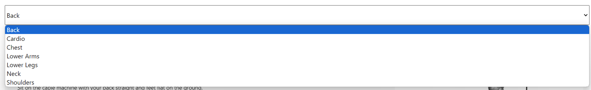
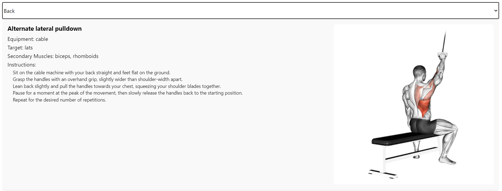

# Workouts App in Spring Boot and React Native

## Overview
The Workouts App is a full-stack application developed using Spring Boot for the backend and React Native for the frontend. The app provides a variety of workout plans categorized by different body parts.

## Backend Endpoints
The backend server runs on `http://localhost:8080` and provides the following endpoints:

- **Back Workouts**: [http://localhost:8080/Back](http://localhost:8080/Back)
- **Cardio Workouts**: [http://localhost:8080/Cardio](http://localhost:8080/Cardio)
- **Chest Workouts**: [http://localhost:8080/Chest](http://localhost:8080/Chest)
- **Lower Arms Workouts**: [http://localhost:8080/LowerArms](http://localhost:8080/LowerArms)
- **Lower Legs Workouts**: [http://localhost:8080/LowerLegs](http://localhost:8080/LowerLegs)
- **Neck Workouts**: [http://localhost:8080/Neck](http://localhost:8080/Neck)
- **Shoulders Workouts**: [http://localhost:8080/Shoulders](http://localhost:8080/Shoulders)

## Frontend Examples

### Choosing a Workout
The app provides an intuitive interface for selecting different workout categories. Below is a screenshot of the workout selection screen:



### Example of Back Workout
Here is an example of the back workout screen, displaying the exercises available for back training:



## Getting Started
To run this application locally, follow the steps below:

1. **Clone the repository**:
   ```bash
   git clone https://github.com/yourusername/workouts-app.git
   cd workouts-app
   ```

2. **Backend Setup**:
   - Navigate to the `backend` directory and build the Spring Boot application:
     ```bash
     cd backend
     ./mvnw spring-boot:run
     ```
   
3. **Frontend Setup**:
   - Navigate to the `frontend` directory and start the React Native application:
     ```bash
     cd frontend
     npm install
     npm start
     ```

4. **Access the Application**:
   - Open your web browser and navigate to `http://localhost:8080` for the backend.
   - Use a mobile device or emulator to access the React Native application or using the web via:`http://localhost:8081` .

## Contributing
If you'd like to contribute to this project, please fork the repository and use a feature branch. Pull requests are welcome.


